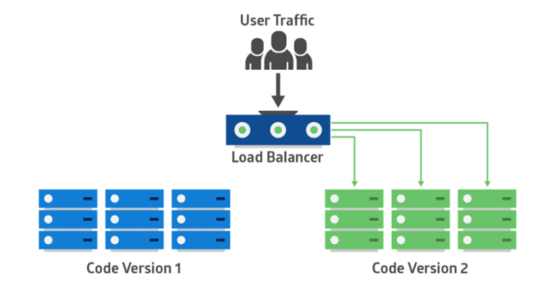

# TIL Template

## 날짜: 2025-01-15

### 스크럼
- 학습 목표 1 : 무중단 배포 딥다이브

### 오늘의 도전 과제와 해결 방법
- 도전 과제 1 : 무중단 배포 내용 정리
# 무중단 배포 및 전략

## 무중단 배포란?

- 서비스를 중단하지 않고 새로운 버전의 소프트웨어를 배포하는 것을 말한다.

## 무중단 배포 전략

## 1. 블루-그린 배포

### 개념

- 두개의 환경`(blue, green)`을 유지하며 현재 실행 중인 환경`(blue)`을 사용하면서 새로운 코드가 적용 된 환경`(green)`을 준비한다. 배포가 완료되면 트래픽을 green 환경으로 전환 하는 전략

### 로드 밸런서

- 교통을 정리하는 역할을 하여 여러 서버에 트래픽을 분산시켜 서버의 부하를 균등하게 유지하고, 시스템의 가용성과 성능을 향상시키는 소프트웨어이다.

### 배포 전

### 배포 후

### 장점

- 롤백이 간단하다. 문제가 발생하면 트래픽을 다시 blue 환경으로 전환하면 된다.
- 트래픽을 모두 새로운 버전으로 옮기기 때문에 호환성 문제가 발생하지 않는다.

### 단점

- 실제 운영에 필요한 서버 리소스 대비 2배의 리소스를 확보해야한다.

## 2. Canary 배포

### 개념

- 새로운 버전을 소수의 사용자(또는 서버)에 먼저 배포하여 문제를 모니터링한 후, 점진적으로 트래픽을 증가시키며 전체 배포를 완료하는 전략.

블루 그린 배포와 유사해 보이지만 트래픽을 한번에 바꾸는것이 아니라 단계적으로 전환한다는 차이점이 존재

### 장점

- 새로운 기능에 대한 실시간 피드백을 수집 할 수 있다.
- 새로운 버전으로 인한 위험을 최소화 할 수 있다.

### 단점

- 두 버전이 함께 존재하기 때문에 호환성 문제가 발생 할 수 있다.

## 3. 롤링배포

### 개념

- 사용 중인 인스턴스들에 새 버전의 서비스를 점진적으로 배포하는 방법으로 서비스 중인 인스턴스 하나를 로드 밸런스에서 라우팅하지 않도록 한 뒤, 새로운 버전의 서비스를 적용하여 다시 라우팅하도록 한다. 이를 반복해서 모든 인스턴스에 새 버전의 서비스를 배포하는 전략

### 장점

- 많은 서버 자원을 확보하지 않아도 무중단 배포가 가능하다.
- 인스턴스마다 차례로 배포를 진행하기 때문에 배포로 인한 위험이 줄어든다.

### 단점

- 배포 진행되는 동안 구버전과 신버전이 공존하기 때문에 호환성 문제가 발생 할 수 있다.
- 새 버전을 배포할 때 배포 도중 서비스 중인 인스턴스 수가 줄어 각각의 서버가 부담하는 트래픽 양이 증가한다.

### 출처

---

https://velog.io/@pp8817/%EB%AC%B4%EC%A4%91%EB%8B%A8-%EB%B0%B0%ED%8F%AC-%EC%A0%84%EB%9E%B5Zero-downtime-Deployment

https://hoehen-flug.tistory.com/53